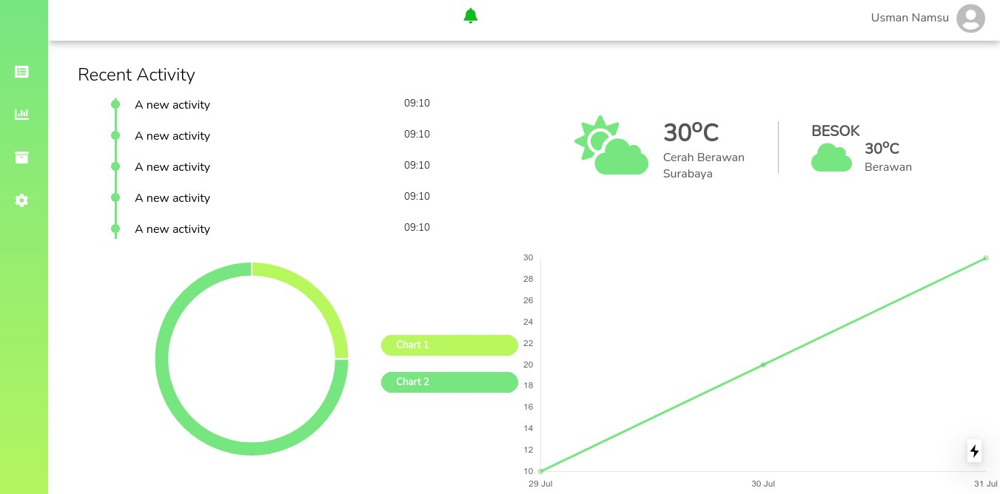

# Tanam Kota

Tanam kota is a smart farming platform to help farmer monitor their plant through a website. The website will show the plant's condition that has been connected with sensor. This is just a prototype website to showcase the design of the website.

